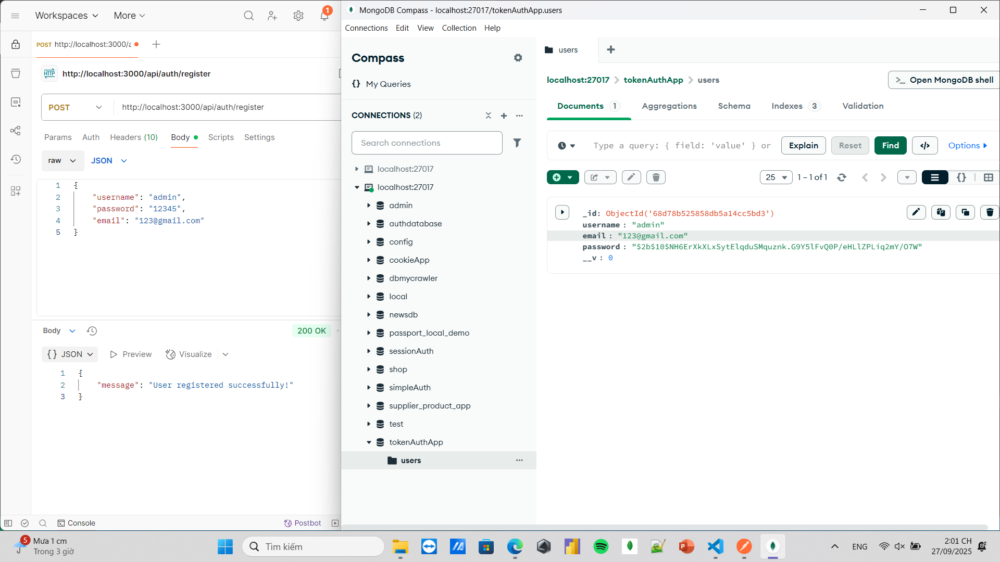
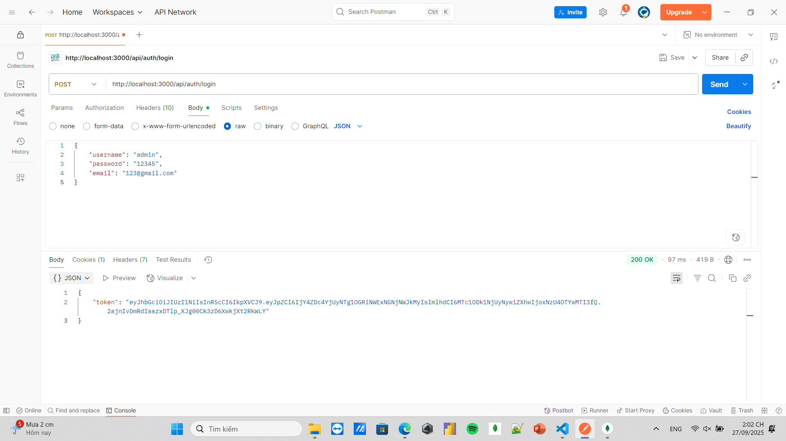
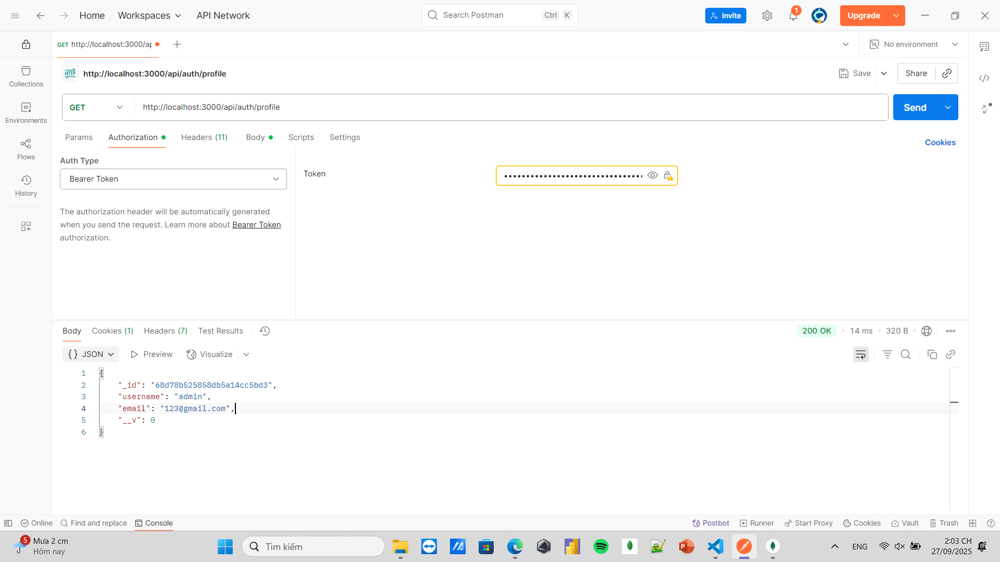
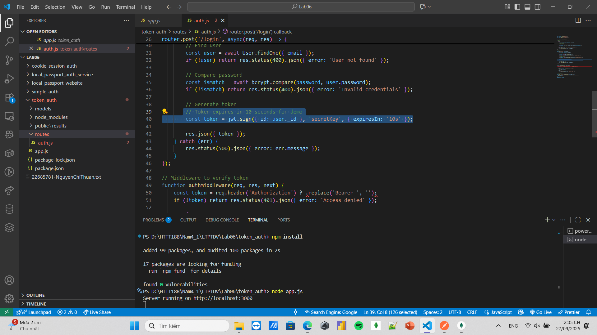

# 🔑 Token Auth

Ứng dụng **Authentication System** sử dụng **Node.js, Express, MongoDB** với cơ chế xác thực bằng **JWT (JSON Web Token)**.  
Dự án này minh họa cách xây dựng hệ thống đăng ký, đăng nhập, xác thực API bằng token.

---

## 🚀 Công nghệ sử dụng
- **Node.js + Express.js** – Backend framework
- **MongoDB + Mongoose** – Database & ODM
- **JWT (jsonwebtoken)** – Xác thực người dùng bằng token
- **Bcrypt.js** – Hash mật khẩu
- **Dotenv** – Quản lý biến môi trường
- **Body-parser** – Xử lý request body

---

## 📂 Cấu trúc thư mục

```bash
token_auth/
│── models/
│ └── userModel.js
│── routes/
│ └── authRoutes.js
│── public/
│ └── results/ (chứa ảnh minh họa)
│── app.js
│── package.json
│── package-lock.json
│── .gitignore
│── README.md
```

## ▶️ Cách chạy
```bash
# 1. Clone repo
git clone https://github.com/your-username/token_auth.git
cd token_auth

# 2. Cài dependencies
npm install

# 3. Chạy server
npm start
```

Server sẽ chạy tại: http://localhost:3000

## 🔑 Tính năng chính

✅ Đăng ký tài khoản (hash mật khẩu bằng bcrypt)
✅ Đăng nhập tài khoản (trả về JWT token)
✅ Bảo vệ route với middleware kiểm tra JWT
✅ Người dùng chỉ truy cập API khi có token hợp lệ

## 🖼️ Ảnh minh họa
## Đăng ký tài khoản


## Đăng nhập (trả về JWT token)


## Truy cập API có bảo vệ


## Thiết lập thời gian Token


